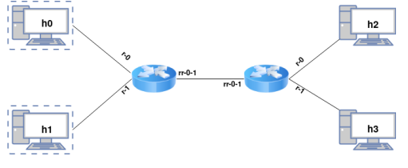

# Dataplane part on router

## Details
This project represents the implementation of the data plane part of a router, made in C. The router described here implements the following functionalities:
-  IPv4

	<details>
		<summary>More...</summary>
		
		- Checking own packets
		- Checksum verification
		- TTL check and update
		- Lookup in the routing table (not linearly)
		- Update checksum
		- L2 address rewriting
		- Sending a packet on the appropriate interface.
	</details>

- ARP protocol
	<details>
		<summary>More...</summary>
		
		- Search cache
		- Save package for later
		- ARP request generation
		- Parse ARP reply
	</details>

- The ICMP protocol
	This router only handles the following situations and messages:
		- Destination unreachable (type 3, code 0)
		- Time exceeded (type 11, code 0)
- Incremental checksum update
	The only reason why the router has to recalculate the checksum is the decrement of the TTL field: thus, for a small change there is an overhead that we would like to avoid. 
	RFC 1624 [5] describes a method to quickly update the IPv4 checksum without recalculating it from scratch.

## Testing 
Mininet is used to simulate a network with the following topology:



You have at your disposal a Python3 script, topo.py, which you can run to create the test setup. This must be run as root:

```$ sudo python3 topo.py```

Thus, the virtual topology will be initialized and one terminal will be opened for each host, one terminal for each router and one for the controller (with which we will not interact); terminals can
be identified by title. 
Each host is a simple Linux machine, from whose terminal you can run commands that generate IP traffic to test the functionality of the implemented router. We recommend arping, ping and netcat. May much, from the terminal we can run Wireshark or tcpdump to inspect the packets.
To start the routers manually, we use the following commands, the first on router 0 and the second on router 1:

```
./router rtable0.txt rr−0−1 r−0 r−1 
./router rtable1.txt rr−0−1 r−0 r−1
```

We also provide you with a suite of tests, which you can run with the "tests" argument:

```
$ sudo python3 topo.py tests
```

## Dependencies 
To simulate a virtual network in which to test our router, we will use the Mininet network emulator. We will need the following packages: mininet and openvswitch-testcontroller. The topology must be run on Linux (we recommend Ubuntu 18.04).

```
$ sudo apt install mininet openvswitch-testcontroller xterm python3-pip
$ sudo cp /usr/bin/ovs-testcontroller /usr/bin/ovs-controller
$ sudo pip3 install scapy
$ sudo pip3 install pathlib
$ sudo pip3 install git+https://github.com/mininet/mininet.git
```

## Copyright 
The rights to the topology, platform and test suite, as well as the title of this project belong to the PCom (2022) team, ACS faculty, UPB.